

    

        

            

                

                    

                        
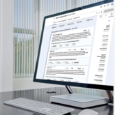

                        

                            Sequencing results - tertiray analysis 
                            <!-- <h3 class="title h4">Software Products</h3> -->
                            

                                navify&reg; Mutation Profiler is a tertiary analysis tool for genome sequencing results. Pathologists and oncologists can use the tool to identify cancer-related mutation profiles similar to their patient's and receive suggestions for open clinical trials, promising treatment, or other relevant scientific information.
                                <ul>
                                    <li class="description"><em> Company:</em> Roche Diagnostics</li>
                                    <li class="description"><em> Lab area:</em> Sequencing Solutions</li>
                                    <li class="description"><em> Product type:</em> Desktop Software</li>
                                    <li class="description"><em> Design involvement:</em> UX Research & Evaluation, UX Design, Risk analysis, Documentation</li>
                                </ul>
                            

                            

                        

                    

                

                

                    

                        
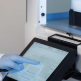

                        

                            Prepare samples for sequencing
                            <!-- <h3 class="title h4">Heading</h3> -->
                            

                               This instrument covers three steps in the process to prepare the samples for sequencing analysis: library preparation, target enrichment, and library quantification according to the protocol and pipeline used for later analysis.
                               <ul>
                                    <li class="description"><em> Company:</em> Roche Diagnostics</li>
                                    <li class="description"><em> Lab area:</em> Sequencing Solutions</li>
                                    <li class="description"><em> Product type:</em> Hardware, embedded software for touchscreen use</li>
                                    <li class="description"><em> Design involvement:</em> UX Research & Evaluation, Design Review, Risk analysis, Documentation</li>
                                </ul>
                            

                            

                        

                    

                

                

                    

                        
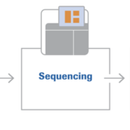

                        

                            Sequencing instrument
                            <!-- <h3 class="title h4">Heading</h3> -->
                            

                                The sequencing instrument performs the primary sequencing analysis on the samples after nucleid acid extraction and sample preparation. This instrument is not yet on the market.
                                <ul>
                                    <li class="description"><em> Company:</em> Roche Diagnostics</li>
                                    <li class="description"><em> Lab area:</em> Sequencing Solutions</li>
                                    <li class="description"><em> Product type:</em> Hardware, embedded software for touchscreen use</li>
                                    <li class="description"><em> Design involvement:</em> UX Research & Evaluation, UX Design & Usability, Risk analysis, Documentation</li>
                                </ul>
                            

                            

                        

                    

                

                

                    

                        
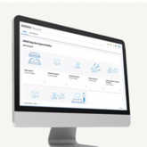

                        

                            Order sequencing analysis kits
                            <!-- <h3 class="title h4">Heading</h3> -->
                            

                                A web-based tool to design or customize sequencing analysis kits and to order the associated reagents and chemicals right at the end of the design process.
                                <ul>
                                    <li class="description"><em> Company:</em> Roche Diagnostics</li>
                                    <li class="description"><em> Lab area:</em> Sequencing Solutions</li>
                                    <li class="description"><em> Product type:</em> Web-based software and ordering tool</li>
                                    <li class="description"><em> Design involvement:</em> UX Design, Design Evaluation, Risk analysis, Documentation</li>
                                </ul>
                            

                            

                        

                    

                

                 

                    

                        
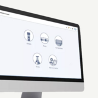

                        

                            A sequencing workflow manager
                            <!-- <h3 class="title 4">Heading</h3> -->
                            

                               This software monitors all steps required for an end-to-end sequencing workflow, monitors all associated devices and analysis steps, tracks the sample and anlysis status, and notifies the user accordingly.
                               <ul>
                                    <li class="description"><em> Company:</em> Roche Diagnostics</li>
                                    <li class="description"><em> Lab area:</em> Sequencing Solutions</li>
                                    <li class="description"><em> Product type:</em> Cloud-based tracking & monitoring tool</li>
                                    <li class="description"><em> Design involvement:</em> UX Research, Workflow analysis, UX Design, Design Evaluation, Risk analysis, Documentation</li>
                                </ul>
                            

                            

                        

                    

                

                

                    

                        
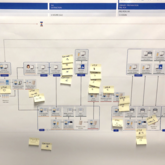

                        

                            Sequencing end-to-end workflow
                            <!-- <h3 class="title h4">Heading</h3> -->
                            

                                For a seamless design and workflow integration, we investigated and analyzed all associated steps from sample accessioning through result display and reporting. Those steps may differ depending on the analysis pipeline, reagent kit, or type of cancer. Thus, understanding both generic and specific workflow steps is crucial for design, systems integration, evaluations, product risk management, and compliant documentation.
                                <ul>
                                    <li class="description"><em> Company:</em> Roche Diagnostics</li>
                                    <li class="description"><em> Lab area:</em> Sequencing Solutions</li>
                                    <li class="description"><em> Product type:</em>User journeys</li>
                                    <li class="description"><em> Design involvement:</em> UX Research, Workflow analysis, Systems integration, Risk analysis, Documentation</li>
                                </ul>
                            

                            

                        

                    

                

                

                    

                        
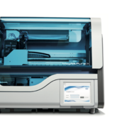

                        

                            Nucleid acid extraction
                            <!-- <h3 class="title 4">Heading</h3> -->
                            

                               A table-top instrument with embedded software for touchscreen operation, the MagNA Pure 24 can extract targets from a wide range of samples such as whole blood, plasma, serum, nasal swabs, urine, or cultured cells.
                               <ul>
                                    <li class="description"><em> Company:</em> Roche Diagnostics</li>
                                    <li class="description"><em> Lab area:</em> Molecular laboratories</li>
                                    <li class="description"><em> Product type:</em> Hardware, embedded software for touchscreen use</li>
                                    <li class="description"><em> Design involvement:</em> Workflow analysis, UX (Re)Design, Design Evaluation, Risk analysis, Documentation</li>
                                </ul>
                            

                            

                        

                    

                

                

                    

                        
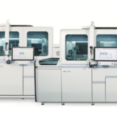

                        

                            Systems for automated PCR
                            <!-- <h3 class="title h4">Heading</h3> -->
                            

                                These large, floor-standing instruments comprise functionalities, consumables, reagents, and data management to automatically run Polymerase Chain Reaction (PCR)  based on Nucleid Acid Testing (NAT). These instruments are for example used for blood screening or virus detection and virus load determination such as SARS-COV2, HIV, or HBV.
                                <ul>
                                    <li class="description"><em> Company:</em> Roche Diagnostics</li>
                                    <li class="description"><em> Lab area:</em> Molecluar laboratories</li>
                                    <li class="description"><em> Product type:</em>Hardware, embedded software for touchscreen use</li>
                                    <li class="description"><em> Design involvement:</em> UX Design & Evaluation, Risk analysis, Documentation</li>
                                </ul>
                            

                            

                        

                    

                

                

                    

                        
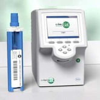

                        

                            Point-of-care PCR
                            <!-- <h3 class="title h4">Heading</h3> -->
                            

                                The cobas&reg; Liat system comprises a point-of-care sized Polymerase Chain Reaction (PCR) instrument and a ready-made assay tube for rapid in <em>vitro diagnostic</em> tests.
                                <ul>
                                    <li class="description"><em> Company:</em> Roche Diagnostics</li>
                                    <li class="description"><em> Lab area:</em> Molecluar laboratories or point-of-care facilities</li>
                                    <li class="description"><em> Product type:</em>Hardware, embedded software for touchscreen use</li>
                                    <li class="description"><em> Design involvement:</em> Usability Evaluation, Risk analysis, Documentation</li>
                                </ul>
                            

                            

                        

                    

                

                

                    

                        
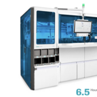

                        

                            Molecular Pre-analytics
                            <!-- <h3 class="title h4">Heading</h3> -->
                            

                                The cobas&reg; Prime instrument automates the pre-analytic workflow in molecular laboratories including to bulk-load different sample containers, read the barcodes, position the containers, de- and recaps the containers, print new barcodes for tracking in the laboratory, and prepares the samples for Polymerase Chain Reaction (PCR) testing. This reduces errors from manual work steps and frees up a lot of time which lab personell can spend on other tasks.
                                <ul>
                                    <li class="description"><em> Company:</em> Roche Diagnostics</li>
                                    <li class="description"><em> Lab area:</em> Molecluar laboratories</li>
                                    <li class="description"><em> Product type:</em>Hardware, embedded software for touchscreen use</li>
                                    <li class="description"><em> Design involvement:</em> UX Design, Hardware Interface Concept and Ergonomic Assessment, Usability Evaluation, Risk analysis, Documentation</li>
                                </ul>
                            

                            

                        

                    

                

                

                    

                        
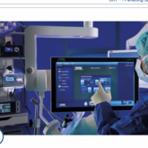

                        

                            Managing minimally invasive surgery
                            <!-- <h3 class="title h4">Heading</h3> -->
                            

                                The OR1&reg; software suite offers multiple functions. While I was involved, we worked on functionalities to allow for remote consultation during surgery, manage videos and stills, enable control of the OR (eg, the overall light conditions), and a monitoring function for circulating nurses for life information from the different ORs they are serving. 
                                <ul>
                                    <li class="description"><em> Company:</em> Karl Storz</li>
                                    <li class="description"><em> Usage:</em> Minimally invasive surgery</li>
                                    <li class="description"><em> Product type:</em>Software with touch and voice interface</li>
                                    <li class="description"><em> Design involvement:</em> UX Design, Usability Evaluation, Risk analysis, Documentation</li>
                                </ul>
                            

                            

                        

                    

                

                

                    

                        
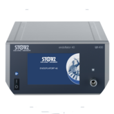

                        

                            Insufflation of the operational field
                            <!-- <h3 class="title h4">Heading</h3> -->
                            

                                In minimally invasive surgery, an insufflator is often used to expand the cavity of the surgical field through a gas for optimal access and view.
                                <ul>
                                    <li class="description"><em> Company:</em> Karl Storz</li>
                                    <li class="description"><em> Usage:</em> Minimally invasive surgery</li>
                                    <li class="description"><em> Product type:</em>Hardware, embedded software for touchscreen use</li>
                                    <li class="description"><em> Design involvement:</em> UX Design, Usability Evaluation, Risk analysis, Documentation</li>
                                </ul>
                            

                            

                        

                    

                

                

                    

                        
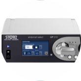

                        

                            Suction or irrigation pump
                            <!-- <h3 class="title h4">Heading</h3> -->
                            

                                This pump can take two functions to support minimally invasive surgery: it can irrigate the surgical field as well as suction fluids or smoke from the surgical field.
                                <ul>
                                    <li class="description"><em> Company:</em> Karl Storz</li>
                                    <li class="description"><em> Usage:</em> Minimally invasive surgery</li>
                                    <li class="description"><em> Product type:</em>Hardware, embedded software for touchscreen use</li>
                                    <li class="description"><em> Design involvement:</em> UX Design, Usability Evaluation, Risk analysis, Documentation</li>
                                </ul>
                            

                            

                        

                    

                

                

                    

                        
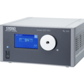

                        

                            Light to the dark
                            <!-- <h3 class="title h4">Heading</h3> -->
                            

                                Excellent view is crucial for minimally invasive surgery. This light source can help to bring light into the dark of the surgical field.
                                <ul>
                                    <li class="description"><em> Company:</em> Karl Storz</li>
                                    <li class="description"><em> Usage:</em> Minimally invasive surgery</li>
                                    <li class="description"><em> Product type:</em>Hardware, embedded software for touchscreen use</li>
                                    <li class="description"><em> Design involvement:</em> UX Design, Usability Evaluation, Risk analysis, Documentation</li>
                                </ul>
                            

                            

                        

                    

                

                

                    

                        
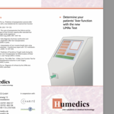

                        

                            Flyer design
                            <!-- <h3 class="title h4">Heading</h3> -->
                            

                                I designed a print flyer for the functional prototype by Humedics which allows to determine a patient's liver function through their respiratory air. The instrument can thus for example support the prognosis of liver function after a hepatectomy.
                                <ul>
                                    <li class="description"><em> Company:</em> Humedics</li>
                                    <li class="description"><em> Usage:</em>Determining a patient's liver function through breath</li>
                                    <li class="description"><em> Design involvement:</em> Flyer design</li>
                                </ul>
                            

                            

                        

                    

                

                

                    

                        
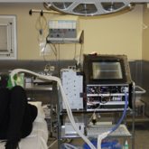

                        

                            Field observation
                            <!-- <h3 class="title h4">Heading</h3> -->
                            

                                For the instrument to determine a patient's liver function, I provided a design concept based on a workflow analysis and field observation.
                                <ul>
                                    <li class="description"><em> Company:</em> Humedics</li>
                                    <li class="description"><em> Usage:</em>Determining a patient's liver function through breath</li>
                                    <li class="description"><em> Design involvement:</em> UX Research, user worklow analysis, Design Concept</li>
                                </ul>
                            

                            

                        

                    

                

                

                    

                        
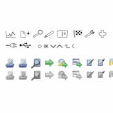

                        

                            Icon design
                            <!-- <h3 class="title h4">Heading</h3> -->
                            

                                Icon design for different products, including hardware and software icons.
                                <ul>
                                    <li class="description"><em> Company:</em> designS</li>
                                    <li class="description"><em> Usage:</em>Icons for various products</li>
                                    <li class="description"><em> Design involvement:</em> Design</li>
                                </ul>
                            

                            

                        

                    

                

                

                    

                        
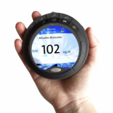

                        

                            SafIRa - non-invasive blood glucose monitoring
                            <!-- <h3 class="title h4">Heading</h3> -->
                            

                                This design study comprises software and and hardware design concepts of a device for non-invasive blood glucose monitoring. Utlizing a rotating hardware element, the user can directly access into main functions of the software.
                                <ul>
                                    <li class="description"><em> Company:</em> My Thesis Industrial Design</li>
                                    <li class="description"><em> Usage:</em>Blood glucose montoring</li>
                                    <li class="description"><em> Design involvement:</em> UX Research, Design Concept</li>
                                </ul>
                            

                            

                        

                    

                

            

        

    

